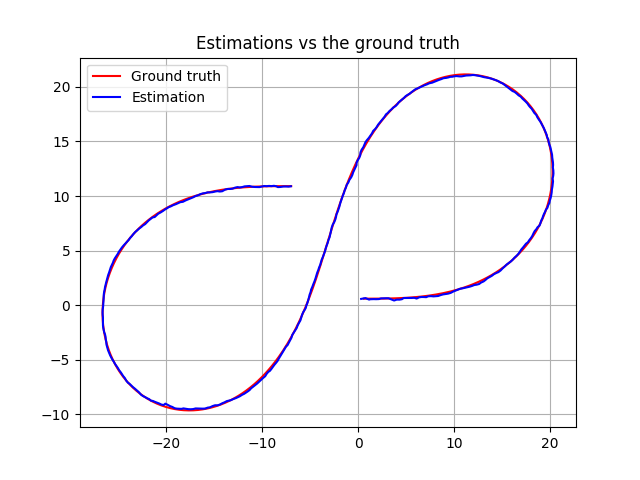

# The Unscented Kalman Filter 

The code uses the Unscented Kalman Filter to estimate the state of a moving object of interest with noisy lidar and radar measurements. This code was built and tested on Linux but can be built on any system where the following dependencies work.

The code can be run in one of the two modes. Please note the dependencies for the mode.
1. Term 2 simulator provided by Udacity is the default mode.
2. Matplotlib interface: This interface is a much lesser turnaround time compared to the simulator and especially useful during debugging and parameter tuning. It uses the [matplotlib-cpp](https://github.com/lava/matplotlib-cpp)
wrapper to draw plots.

### Simulator dependencies
* Term 2 simulator
* uWebSockets

### Matplotlib depencies
These dependencies are _not_ required for the default Simulator interface.
* Python 2.7 headers (`sudo apt-get install python-dev`).
The project should also work with Python 3 but this hasn't been tested.

### Common dependencies
* cmake >= 3.5
* make >= 4.1 (Linux, Mac), 3.81 (Windows)
* gcc/g++ >= 5.4

## Build Instructions

1. Clone this repo. 
2. Make a build directory: `mkdir build && cd build`
3. Compile: `cmake .. && make` 
4. Run it: `./UnscentedKF`

If you're using the Matplotlib interface, 

1. Clone this repo with `git clone --recursive`
2. Make a build directory: `mkdir build && cd build`
3. Compile: `cmake -DUSE_SIMULATOR=ON .. && make` 
4. Run it: `./UnscentedKF <path to data>`

### File structure
1.`data/obj_pose-laser-radar-synthetic-input.txt`: The data file used
2.`src/ukf.cpp`: The core implementation of the Unscented Kalman Filter
3.`src/simconnect.cpp`: Interface with the Udacity simulator
4.`src/mpconnect.cpp`: Interface with Matplotlib
	

## Results and analysis

The filter was tested on `obj_pose-laser-radar-synthetic-input.txt`. It was tuned with to using the RMSE and the NIS values and the following values have been chosen.

```
std_a_ = 1;  
std_yawdd_ = 0.5;  
```
The estimator tracks the data and the ground truth quite well.



The RMSE value of the estimator with respect to the ground truth meet the rubric specifications. These values are also better than the those obtained in the previous project with the EKF. This is especially evident in case of velocity. The reasons could be two-fold. We have not done experiments to evaluate their relative contribution in the improved performance. 
1. CTRV is a more realistic model in this case than assuming a constant velocities along each axes.
2. In many cases, UKF performance is better than EKF under high non-linearities.  


The NIS values were used to tune the filter. As seen below, both Radar and Lidar NIS plots are satisfactory - which means that the estimator residues are in a reasonable range. 


